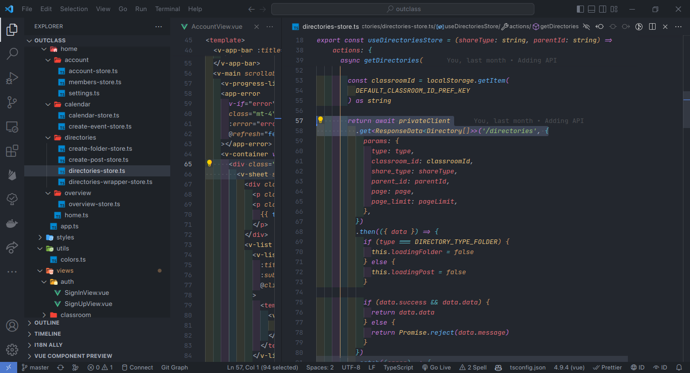

# UAS
## Capaian Perkuliahan
Klik simbol panah (▶) untuk membuka konten
### CLO-0211

  
Demo : Git installation

  
Demo : Github project initialization

  
Demo : Hoppscotch / Postman access

  
Demo : PHP & Composer installation & hello world

<i>Saya menggunakan Vue sebagai penggantinya.</i>

  
Demo : PostgreSQL / MySQL installation

<i>Saya menggunakan MongoDB sebagai penggantinya.</i>

  
Demo : DBeaver installation & DB connection

<i>Saya menggunakan Mongo Compass sebagai penggantinya.</i>

  
Demo : MobaXterm installation & SSH connection

  
Demo : NodeJS & NPM installation, operation & hello world

  
Demo : Linux server operation

  
Demo: Nginx / Apache web server installation & operation

  
Demo: Cpanel operation

  <i>Saya menggantinya dengan menggunakan SSH</i>

  
Demo: Domain registration

### CLO-0212

  
Demo: HTML Responsive Layout with Media Query & Flexbox

  
Demo: Javascript Data Transformation

  
Demo: Browser API - Event Handling, Local Storage, Element manipulation

  
Demo: HTTP GET & POST using Form Action and Fetch API

  
Demo: PHP DB - Dynamic Web Page

<i>Disini saya mendemokannya dengan bahasa Go</i>

  
Demo: PHP DB - Dynamic Web Page

<i>Disini saya mendemokannya dengan framework GoFiber</i>

  
Demo: PHP DB - Web Service

<i>Disini saya mendemokannya dengan bahasa Go</i>

  
Demo: OOP-based PHP Project using Composer

<i>Disini saya mendemokannya dengan JavaScript</i>

  
Demo: Deploy PHP Project to Cpanel

<i>Disini saya mendemokannya dengan deploy ke netlify dan AWS Lightsail</i>

### CLO-0213

  
Demo: HTML Responsive Layout with Bootstrap

<i>Disini saya mendemokannya dengan menggunakan Vuetify Component Library</i>

  
Demo: Dynamic Web Page using Laravel

<i>Disini saya mendemokannya dengan menggunakan Vue</i>

  
Demo: Web Service using Slim

<i>Disini saya mendemokannya dengan framework GoFiber</i>

  
Demo: News Site using Wordpress

<i>Disini saya mendemokannya dengan framework GoFiber</i>

