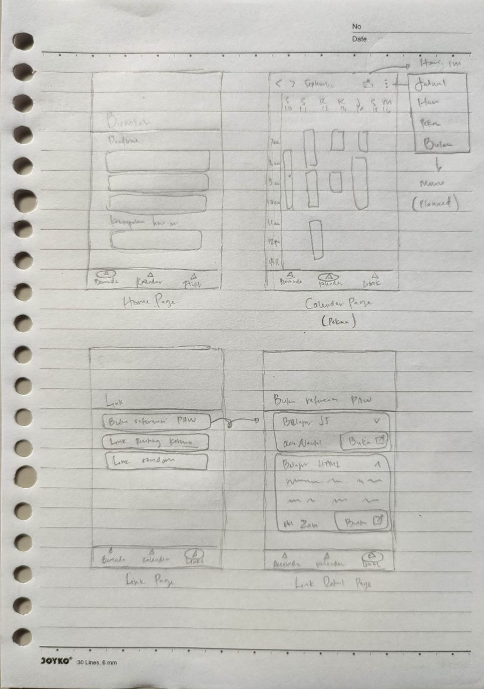
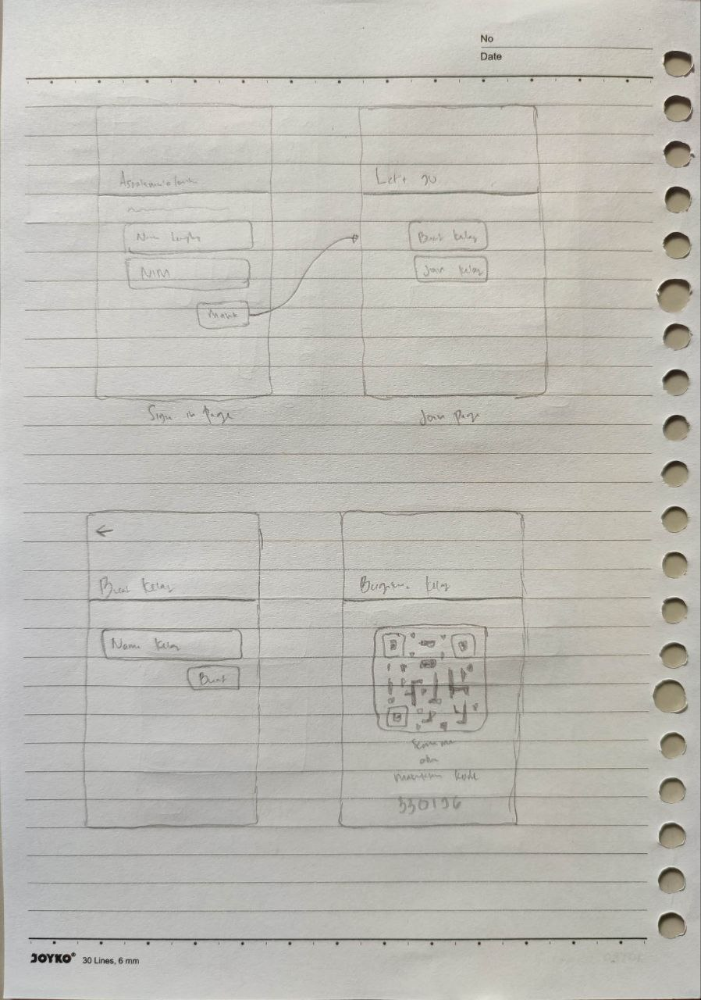
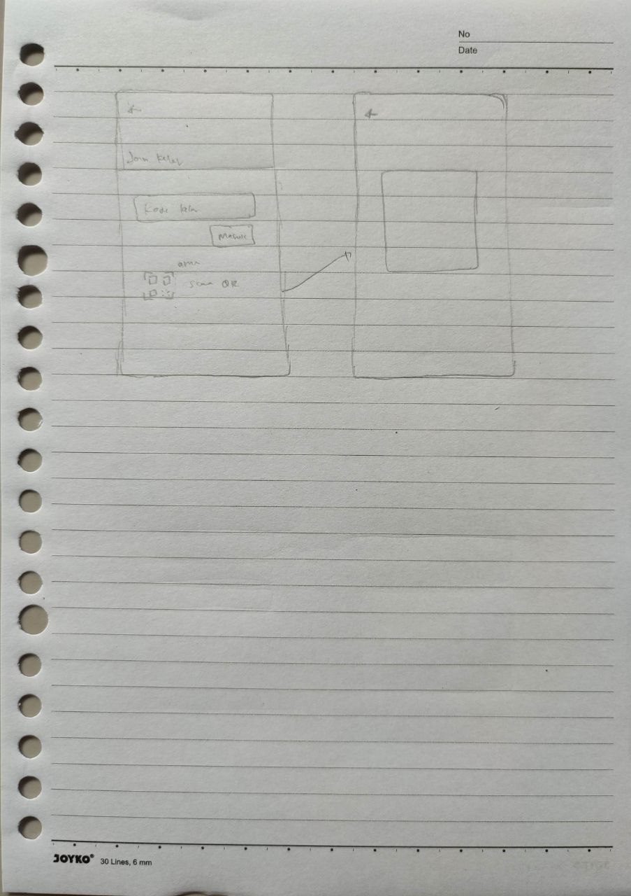

# OutClass

## Deskripsi Masalah
- Terkadang tugas yang diberikan kepada siswa/mahasiswa terlupakan atau tidak tersampaikan dengan baik.
- Buku referensi, link, dan berkas kelas penting lainnya sulit untuk diorganisir.
- Jadwal pelajaran yang sulit untuk diingat setiap harinya.
- Sulit untuk menerima informasi mengenai materi yang disampaikan pada suatu pertemuan, terutama bagi yang tidak masuk kelas pada hari tersebut.

## Deskripsi Solusi
- Membuat aplikasi pengorganisir segala kebutuhan kelas seperti aplikasi OutClass ini.

## Use Case
- User mampu membuat ruang kelas dan mengelolanya.
- User mampu masuk ke ruang kelas yang sudah dibuat.
- User mampu membuat, mengubah, menghapus, dan melihat tugas beserta deadline-nya.
- Setiap user mampu melihat daftar tugas beserta deadline-nya.

## Struktur Data
### User
| Nama Atribut | Tipe Data | Contoh                               |
| ------------ | --------- | ------------------------------------ |
| ID           | string    | 79b8ec97-ea26-4f9b-93c8-a63f27d09c5a |
| Name         | string    | Rizal Hadiyansah                     |
| NIM          | string    | 1207050109                           |

### Classroom
| Nama Atribut | Tipe Data | Contoh                               |
| ------------ | --------- | ------------------------------------ |
| UUID         | string    | be2625cd-97a1-4f7f-93b3-b1df7801b5bf |
| Name         | string    | IF E                                 |
| Created By   | string    | 79b8ec97-ea26-4f9b-93c8-a63f27d09c5a |

### Assignment
| Nama Atribut | Tipe Data | Contoh                                           |
| ------------ | --------- | ------------------------------------------------ |
| UUID         | string    | 60b252e9-27f8-4e3c-a26e-66886fa6cb76             |
| Class ID     | string    | be2625cd-97a1-4f7f-93b3-b1df7801b5bf             |
| Nama         | string    | Tugas Project PAW                                |
| Description  | string?   | Membuat aplikasi berbasis Web untuk proyek akhir |
| Deadline     | datetime  | 2022-09-11T07:58:11Z                             |

### Link Category
| Nama Atribut | Tipe Data | Contoh                               |
| ------------ | --------- | ------------------------------------ |
| UUID         | string    | f64ed7cf-cb14-4748-ac1f-30b10f6a3ab7 |
| Class ID     | string    | be2625cd-97a1-4f7f-93b3-b1df7801b5bf |
| Name         | string    | Buku Referensi PAW                   |

### Link
| Nama Atribut | Tipe Data | Contoh                                 |
| ------------ | --------- | -------------------------------------- |
| UUID         | string    | 3a5c810c-5f5b-4f61-af04-a296b02e3877   |
| Folder ID    | string    | f64ed7cf-cb14-4748-ac1f-30b10f6a3ab7   |
| URL          | string    | https://goalkicker.com/JavaScriptBook/ |
| Description  | string?   | Buku Belajar Javascript PDF            |

### Event
| Nama Atribut | Tipe Data | Contoh                               |
| ------------ | --------- | ------------------------------------ |
| UUID         | string    | 034c51a8-d37f-484a-a2f7-3dc1449a45a4 |
| Class ID     | string    | be2625cd-97a1-4f7f-93b3-b1df7801b5bf |
| Name         | string    | Absen PAW                            |
| Date         | datetime  | 2022-09-12T08:40:00Z                 |
| End Date     | datetime? | 2022-09-12T10:20:00Z                 |

## UX Wireframe

